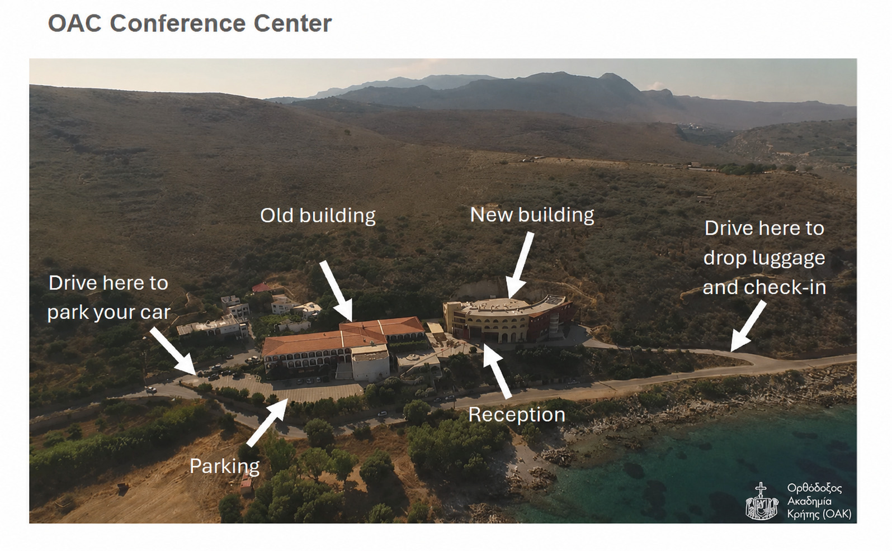
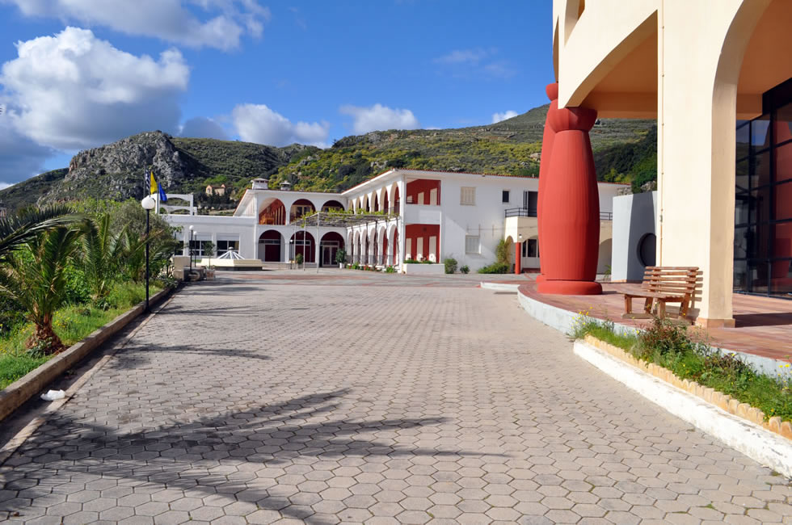
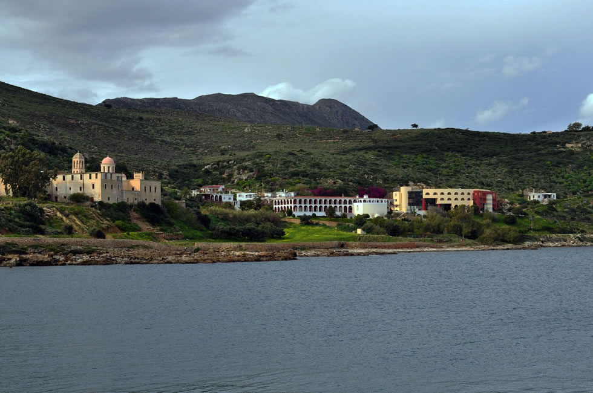

<center>

We are happy to invite you to the inaugural

[Invertebrate Inherited Intracellular Interactions (I4) conference]{style="color: #2D4197; font-size: 40px; font-weight: bold"}

<span style="font-size: 28px; font-weight: bold">

<p>June 29 – July 4, 2027</p>

<p>Kolymvari, Crete</p>

</span>


This conference brings together researchers of any career stage working on intracellular microbes of invertebrates. In this fast developing field, we hope to foster intense scientific exchange in a friendly and inclusive atmosphere. We will hear about recent developments in the field from several keynote speakers and encourage all participants to present on their own novel findings.

We look forward to welcoming you in Crete!

[The organising committee](team.qmd)

</center>


::: column-margin
::: callout-important
## Upcoming deadlines

|||
|--------------|-----------:|
| Scholarships | **Jan 15** |
| Abstracts    | **Jan 31** |
| Early bird   | **Feb 28** |
| Regular      | **Mar 31** |

:::
:::


## Sessions and keynotes

This is a preliminary list of sessions and keynote speakers. More confirmed speakers will be added soon.



## Venue

OAC – more information soon!

## Conference fees

The registration fee covers accommodation, all meals (breakfast, lunch, dinner), coffee/tea during the breaks, participation at the welcome reception, and at traditional Cretan night, plus a group excursion.

During the registration process, participants will have the option to specify someone as their roommate and, wherever possible, these requests will be honored. Single room accommodation will be allocated on a first come first serve basis. Participants with special needs will have priority to single room accommodations. It is also possible to book accommodation outside of the Academy.

|                                                     | Early bird | Regular|
|-----------------------------------------------------|-----------:|-------:| 
| Conference & single room at OAC + all meals         |     1040 € | 1240 € | 
| Conference & shared double room at OAC + all meals  |      880 € | 1080 € | 
| Conference only (no accommodation and meals at OAC) |      660 € |  860 € |

## Registration and abstract submission

Registration will open soon, please stay tuned!

## Stipends for junior researchers

The organizing committee is pleased to announce the partial waiver (50%) of registration and accommodation fees for master and PhD students as well as early career postdocs (<= 4 years post PhD).

Selected candidates are expected to present their work with oral or poster presentations Applicants from typically underrepresented regions (e.g., the global south) are especially encouraged to apply. 

Applications can be made during the abstract submission process and must include 

* Official document of your institution that demonstrates your position
* A short CV
* A cover letter expressing your interest in the conference and a justification for why you require the financial support

The outcome of the decision process will be communicated in time for registration. 
 
## Important dates and deadlines

|||
|--------------------------------------------|-------------------:|
| Scholarship application deadline           | **15 / 01 / 2027** |
| Abstract submission deadline               | **31 / 01 / 2027** |
| Abstract/scholarship decision announcement | **15 / 02 / 2027** |
| Early bird registration deadline           | **28 / 02 / 2027** |
| Regular registration deadline              | **31 / 03 / 2027** |


## Venue & access 

The I4 Conference will take place at the [Orthodox Academy Crete](https://www.oac.gr/en).







The Orthodox Academy of Crete (OAC) is about 39 km from the airport (Chania International Airport Ioannis Daskalogiannis – CHQ) and 24 km from the city of Chania.

From the airport, delegates and visitors may reach the OAC:

  By taxi the venue is about 35-40 minutes ride.

  Alternatively, delegates can travel from the airport to Chania central bus station by either bus or taxi and from there to Kolymvari by bus/coach service ([https://www.e-ktel.com/en/](https://www.e-ktel.com/en/)). Buses run from the city of Chania to Kolymvari approximately every twenty minutes ([bus schedule](https://www.e-ktel.com/images/announcements/CHANIA_FROM_11-09-2026A.pdf)). The OAC is about 1.5 km from the bus stop in the center of Kolymvari.

```{r}
#| echo: false
#| message: false
#| warning: false
#| column: screen-inset-right

library(leaflet)
leaflet() %>%
  addTiles() %>% 
  addMarkers(lat=35.55257186486049, lng=23.776715130601563, popup="Orthodox Academy of Crete")
```


## Contact

For any queries about the conference, please write to the organising committee:  [contact@i4conference.com](mailto:contact@i4-conference.com).